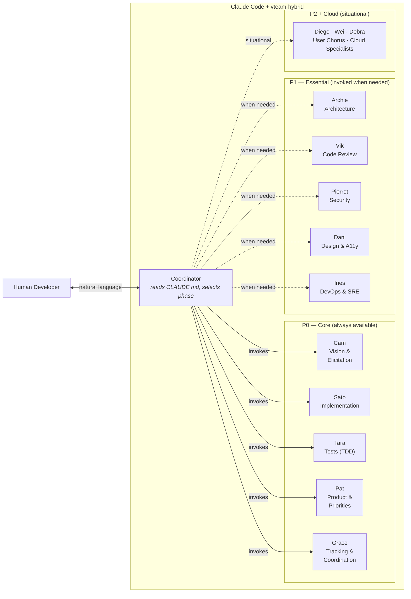
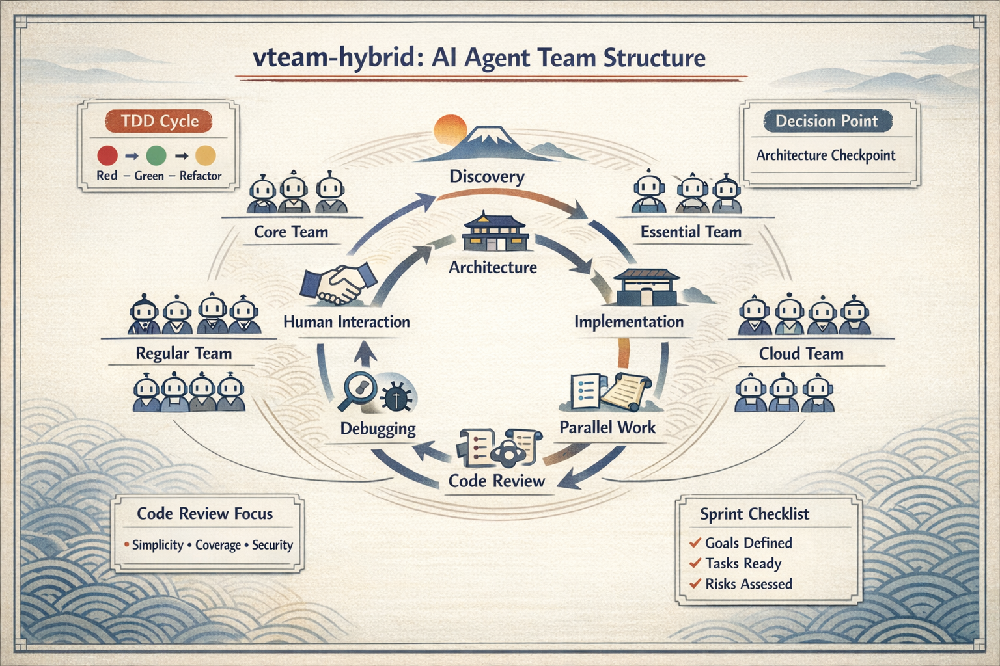

<!-- agent-notes: { ctx: "public-facing README for GitHub template repo", deps: [CLAUDE.md, docs/template-guide.md, docs/methodology/phases.md, docs/methodology/personas.md], state: active, last: "diego@2026-02-25" } -->

# vteam-hybrid

A virtual development team for [Claude Code](https://docs.anthropic.com/en/docs/claude-code) — 18 AI agent personas, a 7-phase hybrid methodology, and 24 workflow commands covering the full development lifecycle.

## What This Is

[Claude Code](https://docs.anthropic.com/en/docs/claude-code) is Anthropic's CLI for AI-assisted development — you chat with Claude in your terminal and it can read/write files, run commands, and spawn specialized sub-agents. This template configures Claude Code with a team of specialized agents and structured workflows so that instead of a single AI assistant, you get an architect, a tester, a security reviewer, a project manager, and more — collaborating through defined phases with built-in quality gates.

**You only need to know 5 agents to start.** The rest activate automatically when the work demands it.

### What it looks like

You talk to Claude Code in your terminal. The template's agents handle the rest:

```
You:  I want to build a CLI tool that converts markdown to PDF

Cam:  Let me explore that with you. Who's the target user —
      developers or non-technical users? And what's your priority:
      fidelity to the markdown spec, or speed of conversion?

You:  Developers, and speed matters more than perfect rendering.

Cam:  Got it. Let me probe a few more things before we commit to
      an approach...
```

After discovery, you'd run `/tdd add-pdf-export` and the system hands off to Tara (who writes failing tests) and then Sato (who makes them pass). You stay in control — the agents do the structured work.

### Requirements

- [Claude Code](https://docs.anthropic.com/en/docs/claude-code) (CLI)
- Git
- [GitHub CLI](https://cli.github.com/) (`gh`) — for project board integration (optional but recommended)

## How It Works



## The 7 Phases

The coordinator automatically selects the right team structure for each phase of work:

| Phase | When | Lead | What Happens |
|-------|------|------|-------------|
| 1. Discovery | New idea or vague request | Cam | Probing, clarifying, pressure-testing the vision |
| 2. Architecture | Design decisions needed | Archie | ADR + adversarial debate with Wei |
| 3. Implementation | Code to write | Tara then Sato | TDD: Tara writes failing tests, Sato makes them pass |
| 4. Parallel Work | 3+ independent items | Grace | Multiple agents working concurrently |
| 5. Code Review | Changes to review | Vik + Tara + Pierrot | Three lenses: simplicity, tests, security |
| 6. Debugging | Bug to fix | Sato | Shared investigation with Tara, Vik, Pierrot |
| 7. Human Interaction | User consultation needed | Cam | Single point of contact for the human |



## Quick Start

1. **Use this template** — click "Use this template" on GitHub, or clone and reinitialize
2. **Scaffold your tech stack:**
   - `/scaffold-cli` — Python or Rust CLI
   - `/scaffold-web-monorepo` — TypeScript monorepo (Next.js, React)
   - `/scaffold-ai-tool` — Python AI/ML tool (FastAPI, Streamlit)
   - `/scaffold-static-site` — Static site (GitHub Pages)
3. **Run discovery** — `/kickoff` to define your product and set up tracking
4. **Start building** — `/tdd <feature>` for TDD-driven development

## Command Reference

### Lifecycle

| Command | What It Does |
|---------|-------------|
| `/kickoff` | Full 5-phase discovery workflow with board setup |
| `/plan` | Create an implementation plan for a feature |
| `/tdd` | TDD workflow: Tara writes failing tests, Sato implements |
| `/code-review` | Three-lens code review (simplicity, tests, security) |
| `/review` | Guided human review session with Cam |
| `/sprint-boundary` | Sprint retro, backlog sweep, process gate, next sprint setup |
| `/handoff` | Save session state for the next session to resume |
| `/resume` | Pick up from a previous session's handoff |
| `/retro` | Kaizen retrospective with GitHub issues for findings |

### Design & Architecture

| Command | What It Does |
|---------|-------------|
| `/design` | Sacrificial concept exploration with Dani |
| `/adr` | Create a new Architecture Decision Record |
| `/restack` | Re-evaluate tech stack choices |

### Scaffolding

| Command | What It Does |
|---------|-------------|
| `/scaffold-cli` | Scaffold a CLI project (Python/Rust) |
| `/scaffold-web-monorepo` | Scaffold a web/mobile monorepo (TypeScript) |
| `/scaffold-ai-tool` | Scaffold an AI/data tool (Python) |
| `/scaffold-static-site` | Scaffold a static site (GitHub Pages) |

### Maintenance

| Command | What It Does |
|---------|-------------|
| `/pin-versions` | Pin dependency versions, update SBOM |
| `/sync-template` | Reapply template evolutions to an in-flight repo |
| `/devcontainer` | Set up a dev container for any stack |
| `/sync-ghcp` | Sync agent definitions to GitHub Copilot format |

### Cloud

| Command | What It Does |
|---------|-------------|
| `/aws-review` | AWS deployment readiness review |
| `/azure-review` | Azure deployment readiness review |
| `/gcp-review` | GCP deployment readiness review |
| `/cloud-update` | Refresh cloud service landscape research |

## Key Features

- **TDD Pipeline** — Tara writes failing tests first, Sato makes them pass. Structural quality enforcement, not just "write tests."
- **Adversarial Debate** — Wei challenges architectural decisions through structured multi-round debate. Catches design flaws before implementation.
- **Agent-Notes Protocol** — Structured metadata at the top of every file lets agents decide whether to read a file before opening it. Reduces context waste.
- **Session Handoff/Resume** — `/handoff` saves session state; `/resume` picks up where you left off. Solves the ephemeral context problem.
- **Done Gate** — 15-item quality checklist every work item must pass. Tests, types, lint, review, accessibility, SBOM, and more.

## Learning Path

Read in this order. Stop when you have enough:

| # | Doc | Time | What You'll Learn |
|---|-----|------|-------------------|
| 1 | [Template Guide](docs/template-guide.md) | 5 min | What's included, how to customize |
| 2 | [Phases (TL;DR)](docs/methodology/phases.md#tldr) | 2 min | The 7 phases at a glance |
| 3 | [Phases (full)](docs/methodology/phases.md) | 10 min | How each phase works, who participates |
| 4 | [Personas](docs/methodology/personas.md) | skim | The 18-agent roster, capabilities, tiers |

## License

[MIT](LICENSE)
