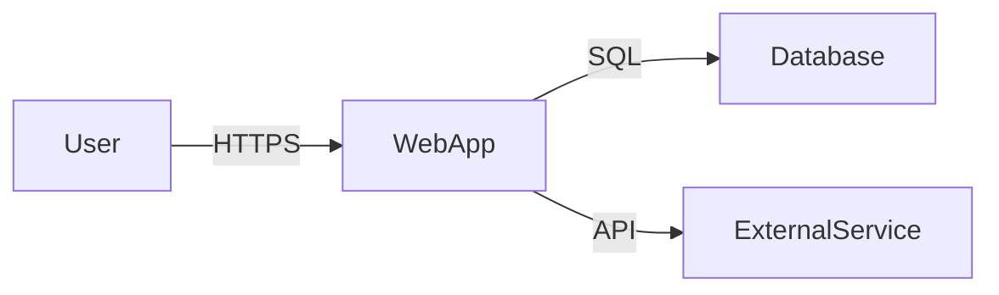

---
agent-notes:
  ctx: "STRIDE threat model, attack surface inventory"
  deps: []
  state: stub
  last: "pierrot@2026-02-15"
  key: ["created during Architecture phase", "Pierrot owns, Archie contributes DFDs"]
---
# Threat Model

<!-- Pierrot owns this document. Archie contributes data flow diagrams. -->
<!-- Created during kickoff Phase 3 (Architecture). Updated when the attack surface changes. -->

**Project:** [Project Name]
**Last reviewed:** [Date]
**Reviewed by:** Pierrot, Archie

## System Overview

<!-- High-level description of what the system does, who uses it, and what data it handles. -->

## Data Flow Diagram

<!-- Mermaid diagram showing data flows, trust boundaries, and external dependencies. -->
<!-- Archie creates the DFD; Pierrot annotates trust boundaries and threat surfaces. -->

## Trust Boundaries

| Boundary | Description | Controls |
|----------|-------------|----------|
| <!-- e.g. Internet → App --> | <!-- User traffic enters the system --> | <!-- TLS, WAF, rate limiting --> |

## Assets

What are we protecting?

| Asset | Classification | Storage | Impact if compromised |
|-------|---------------|---------|----------------------|
| <!-- e.g. User credentials --> | <!-- Confidential --> | <!-- DB, bcrypt hashed --> | <!-- Account takeover --> |

## STRIDE Analysis

For each component/data flow, assess threats across six categories:

### Spoofing (Identity)

| Component | Threat | Likelihood | Impact | Mitigation | Status |
|-----------|--------|------------|--------|------------|--------|
| | | | | | |

### Tampering (Data Integrity)

| Component | Threat | Likelihood | Impact | Mitigation | Status |
|-----------|--------|------------|--------|------------|--------|
| | | | | | |

### Repudiation (Accountability)

| Component | Threat | Likelihood | Impact | Mitigation | Status |
|-----------|--------|------------|--------|------------|--------|
| | | | | | |

### Information Disclosure (Confidentiality)

| Component | Threat | Likelihood | Impact | Mitigation | Status |
|-----------|--------|------------|--------|------------|--------|
| | | | | | |

### Denial of Service (Availability)

| Component | Threat | Likelihood | Impact | Mitigation | Status |
|-----------|--------|------------|--------|------------|--------|
| | | | | | |

### Elevation of Privilege (Authorization)

| Component | Threat | Likelihood | Impact | Mitigation | Status |
|-----------|--------|------------|--------|------------|--------|
| | | | | | |

## Attack Surface Inventory

| Surface | Protocol | Auth required? | Exposed to | Notes |
|---------|----------|---------------|------------|-------|
| <!-- e.g. /api/v1/* --> | <!-- HTTPS --> | <!-- JWT --> | <!-- Internet --> | <!-- Rate limited --> |

## Open Risks

Risks that are accepted or not yet mitigated:

| Risk | Severity | Rationale for acceptance | Review date |
|------|----------|------------------------|-------------|
| | | | |
