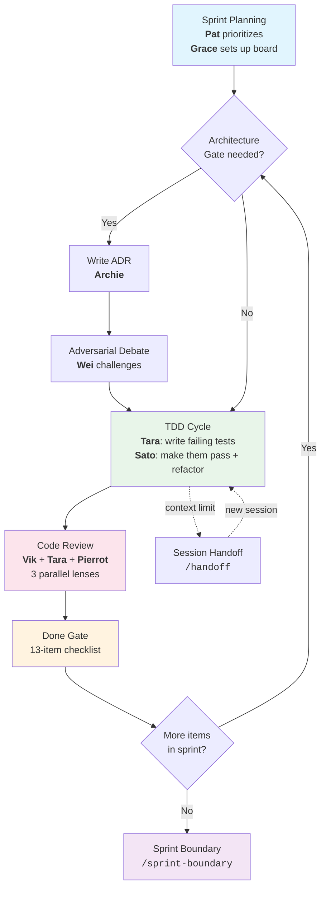

# vteam-hybrid Template Guide

This document explains what the template provides and how to customize it. Unlike README.md (which gets replaced after scaffolding), this guide persists as a reference.

## What This Template Is

vteam-hybrid is a GitHub repo template for projects that use Claude Code with a virtual team methodology. It provides:

1. **18 specialized agent personas** organized into priority tiers (P0 Core, P1 Essential, P2 Regular, Cloud)
2. **7-phase hybrid team methodology** that adapts team structure to the current development phase
3. **Agent-notes protocol** for fast context bootstrapping across sessions
4. **24 command workflows** covering the full development lifecycle
5. **Integration adapters** for different project tracking tools (GitHub Projects, Jira)
6. **Cloud specialist agents** that adapt to AWS, Azure, or GCP

## Template Lineage

- **vteam-base** — Foundation template: core personas, TDD workflow, ADR conventions
- **vteam-agentapalooza** — Extended template: full 32-agent roster
- **vteam-hybrid** (this template) — Consolidated: 32 agents merged to 18, plus hybrid methodology and agent-notes

### Key Innovations

**Agent Consolidation (32 → 18).** Related personas merged into single agents with multiple "lenses":
- Pat = PO Pat + PM Priya (product + program)
- Grace = Gantt Grace + TPM Tomas (tracking + coordination)
- Archie = Archie + Schema Sam + Contract Cass (architecture + data + API)
- Pierrot = Pierrot + RegRaj (security + compliance)
- Ines = Ines + On-Call Omar + Breaker Bao (DevOps + SRE + chaos)
- Cloud specialists = three per-cloud agents merged into one adaptive agent each

**Hybrid Team Methodology.** Phase-adaptive teams instead of fixed hierarchy. See `docs/methodology/phases.md`.

**Agent-Notes Protocol.** Structured metadata at the top of every file for fast context bootstrapping. See `docs/methodology/agent-notes.md`.

## Sprint Lifecycle



## Getting Started

### 1. Create a Repo from This Template

Click "Use this template" on GitHub, or clone and reinitialize:

```bash
git clone <this-repo> my-project
cd my-project
rm -rf .git
git init
git add -A
git commit -m "chore: initialize from vteam-hybrid template"
```

### 2. Scaffold Your Tech Stack

Run one of the scaffold commands:
- `/scaffold-cli` — Python or Rust CLI tool
- `/scaffold-web-monorepo` — TypeScript monorepo with Next.js, React, etc.
- `/scaffold-ai-tool` — Python AI/ML tool with FastAPI, Streamlit, etc.
- `/scaffold-static-site` — Static site for GitHub Pages

### 3. Run Discovery

Use `/kickoff` to run the full 5-phase discovery workflow before building.

### 4. Start Building

Follow the TDD workflow: `/tdd <feature>` for each piece of work.

## File Map

| Path | Purpose |
|------|---------|
| `CLAUDE.md` | Slim runtime instructions for Claude Code |
| `docs/methodology/` | System docs (phases, personas, agent-notes) |
| `docs/process/` | Governance, done gate, gotchas, doc ownership |
| `docs/integrations/` | Tracking adapters (GitHub Projects, Jira) |
| `docs/scaffolds/` | Project stub docs (moved to `docs/` during scaffold) |
| `docs/adrs/` | Architecture Decision Records |
| `docs/adrs/template/` | Template-specific ADRs (removed during scaffold) |
| `.claude/agents/*.md` | 18 runnable agent definitions |
| `.claude/commands/*.md` | 24 workflow commands (see Command Reference below) |

## Command Reference

All commands are invoked as `/<name>` in Claude Code (e.g., `/kickoff`, `/tdd`).

### Lifecycle

| Command | Description |
|---------|-------------|
| `kickoff` | Full 5-phase discovery workflow with board setup |
| `plan` | Create an implementation plan for a feature |
| `tdd` | TDD workflow: Tara writes failing tests, Sato implements |
| `code-review` | Three-lens code review (simplicity, tests, security) |
| `review` | Guided human review/walkthrough session with Cam |
| `sprint-boundary` | Sprint retro, backlog sweep, process gate, next sprint setup |
| `handoff` | Save session state for the next session to resume |
| `resume` | Pick up from a previous session's handoff |
| `retro` | Kaizen retrospective with GitHub issues for findings |

### Design & Architecture

| Command | Description |
|---------|-------------|
| `design` | Sacrificial concept exploration with Dani |
| `adr` | Create a new Architecture Decision Record |
| `restack` | Re-evaluate tech stack choices |

### Scaffolding

| Command | Description |
|---------|-------------|
| `scaffold-cli` | Scaffold a CLI project (Python/Rust) |
| `scaffold-web-monorepo` | Scaffold a web/mobile monorepo (TypeScript) |
| `scaffold-ai-tool` | Scaffold an AI/data tool (Python) |
| `scaffold-static-site` | Scaffold a static site (GitHub Pages) |

### Maintenance

| Command | Description |
|---------|-------------|
| `pin-versions` | Pin dependency versions, update SBOM |
| `sync-template` | Reapply template evolutions to an in-flight repo |
| `devcontainer` | Set up a dev container for any stack |
| `sync-ghcp` | Sync agent definitions to GitHub Copilot format |

### Cloud

| Command | Description |
|---------|-------------|
| `aws-review` | AWS deployment readiness review |
| `azure-review` | Azure deployment readiness review |
| `gcp-review` | GCP deployment readiness review |
| `cloud-update` | Refresh cloud service landscape research |

## Customization Guide

### Adding a New Agent

1. Create `.claude/agents/<name>.md` with proper frontmatter (see existing agents for format)
2. Add the agent to `docs/methodology/personas.md`
3. Update `docs/methodology/phases.md` with the agent's phase participation

### Modifying an Existing Agent

Edit the agent file directly. Update `last` in its agent-notes. If the change affects phase participation, update `docs/methodology/phases.md`.

### Adding a New Command

Create `.claude/commands/<name>.md` with an agent-notes HTML comment as the first line. Commands are auto-discovered by Claude Code.

### Switching Tracking Tools

See `docs/integrations/README.md` for how to switch between GitHub Projects, Jira, or other adapters.

### Scaling Notes

- **Solo / small project (1-3 agents):** Collapse further. Sato absorbs Ines's infra work. Code-reviewer covers all review. Pat handles all planning.
- **Medium project (2-3 teams):** Full roster. Grace earns her keep with cross-team coordination.
- **Large project (4+ teams):** Every role is distinct. Consider splitting consolidated agents back into specialists.
